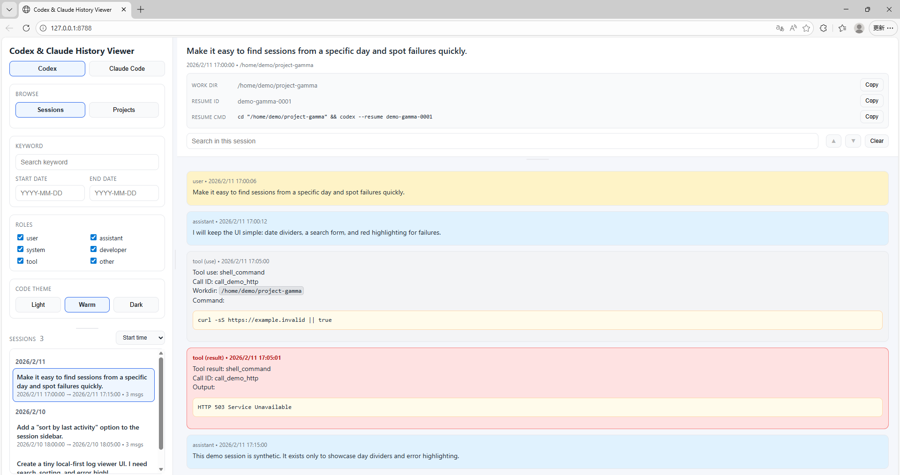
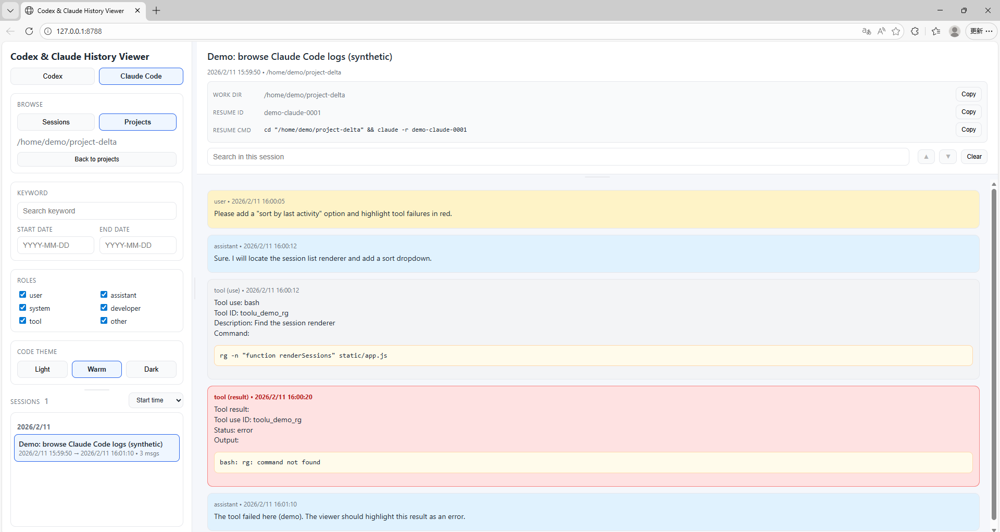

# Codex & Claude History Viewer

Local-first, dependency-free web viewer for **Codex CLI** and **Claude Code** session logs.

- Browse sessions and projects (work dirs)
- Search sessions by keyword + date range
- Filter messages by role, and search within a session (highlight + next/prev)
- Sort sidebar by **start time** or **last activity**
- Highlight interruptions and common error outputs

> Not affiliated with OpenAI or Anthropic. “Codex” and “Claude” are trademarks of their respective owners.



<details>
<summary>More screenshots</summary>



</details>

## Why

Codex CLI and Claude Code both generate local, machine-readable transcripts (JSONL). This project turns those logs into a fast, searchable “history inbox” you can use to:

- find past commands/patches/discussions quickly
- audit tool failures and interruptions
- compare sessions across days/projects
- keep everything **local** (no uploads by default)

## Quick start

Requirements:

- Python 3.8+ (standard library only)
- A modern browser

Run:

```bash
python3 app.py
```

Open:

- http://127.0.0.1:8787

By default it reads:

- Codex logs: `~/.codex/sessions`
- Claude logs: `~/.claude/projects`

Indexes (SQLite) are stored next to `app.py` (the repo folder) unless you set `--data-dir`.

## Configuration

Show all options:

```bash
python3 app.py --help
```

## Demo data (included)

This repo includes a small set of **synthetic** Codex/Claude logs under `demo/` so you can try the UI without using your own transcripts.

```bash
python3 app.py \
  --codex-dir ./demo/codex \
  --claude-dir ./demo/claude \
  --data-dir ./demo/.data
```

Common examples:

```bash
# Store indexes outside the repo (recommended)
python3 app.py --data-dir ~/.cache/cchv

# Bind to LAN (be careful: your logs may contain secrets)
python3 app.py --host 0.0.0.0 --port 8787

# Custom log locations (these are the *base dirs* that contain `sessions/` and `projects/`)
python3 app.py --codex-dir ~/.codex --claude-dir ~/.claude

# Faster/slower auto-rescan (seconds)
python3 app.py --scan-interval 2
```

## Using the UI

- **Source**: switch between Codex / Claude Code logs.
- **Browse**:
  - **Sessions**: list individual sessions.
  - **Projects**: group sessions by working directory (cwd).
- **Sidebar sort**: top-right dropdown in the sessions list:
  - `Start time` (default)
  - `Last activity`
- **Roles**: toggle user/assistant/system/developer/tool/other.
- **Search**
  - Left panel: keyword search across sessions + optional date range.
  - Right panel: search within the opened session (highlight + ▲/▼ navigation).
- **Error highlighting**
  - User interruptions (e.g. `turn_aborted`) are highlighted.
  - Common tool failures (HTTP 4xx/5xx, Traceback/Exception, `Status: error`, etc.) are highlighted.

## Privacy & safety notes

- Your local transcripts may contain sensitive info (API keys, file paths, proprietary code).
- If you bind `--host 0.0.0.0`, anyone on your network may be able to access the UI. Prefer `127.0.0.1`.
- Index files are local SQLite databases; this repo’s `.gitignore` excludes them.

## Related projects (similar idea)

If you need more features (export, nicer UI, desktop app), these are worth checking out:

- Agent Session Viewer (PyPI): https://pypi.org/project/agent-session-viewer/
- Agent Sessions (macOS app): https://github.com/jazzyalex/agent-sessions
- Contextify (macOS app): https://apps.apple.com/us/app/contextify/id6740947877
- Codexia (GUI for Codex/Claude): https://github.com/Fleqpe/Codexia

## Publishing

See `PUBLISHING.md` for a ready-to-use GitHub checklist + announcement copy.

## License

MIT (see `LICENSE`).
